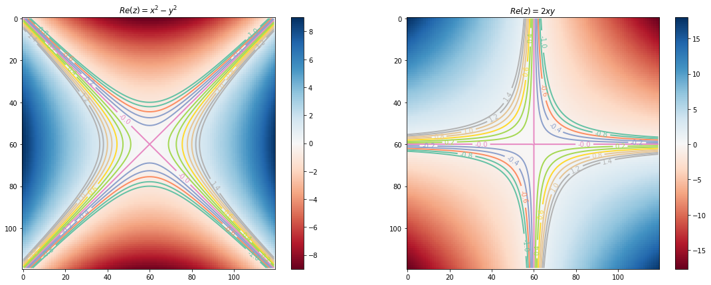
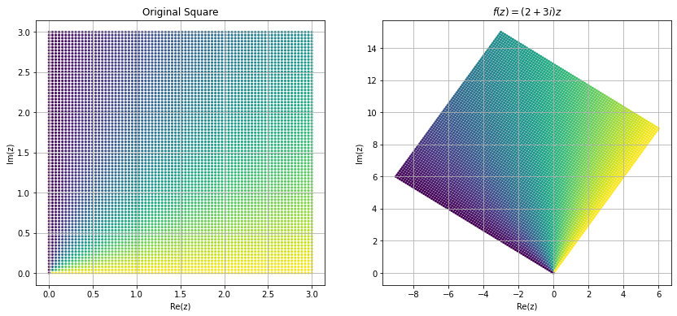
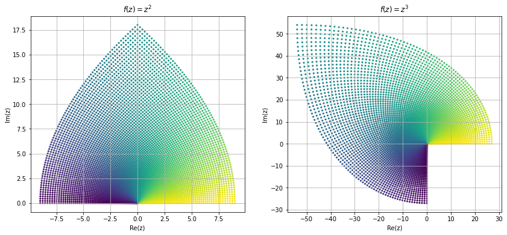
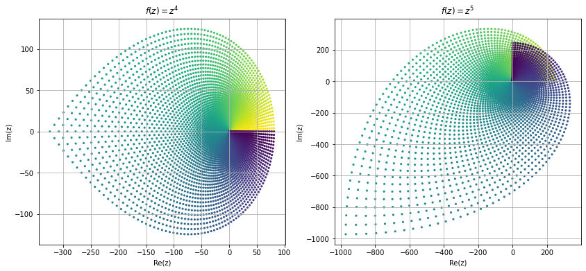
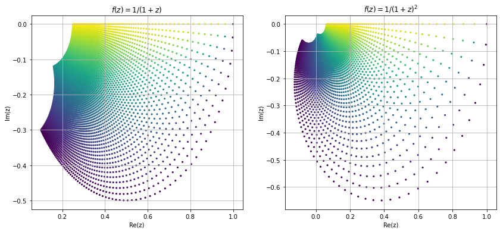
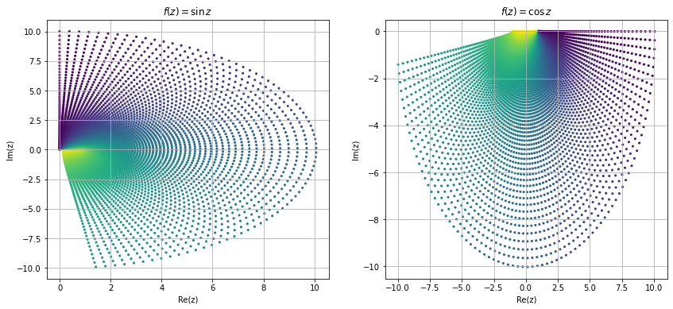
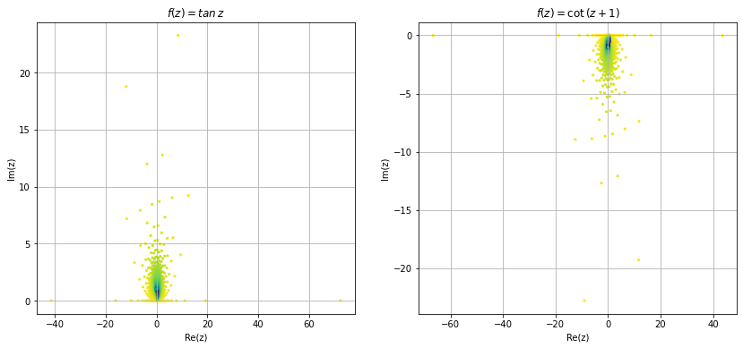
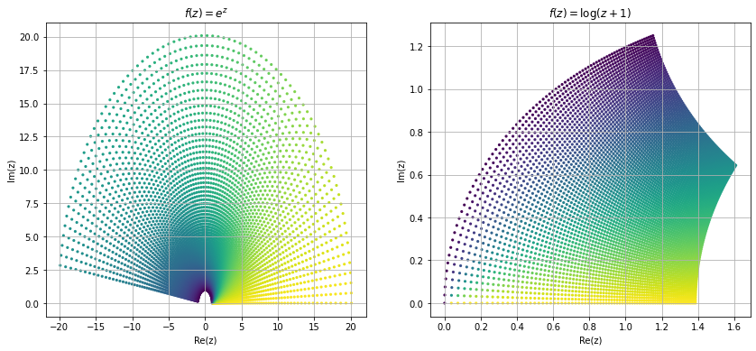

# Function

After learning about complex numbers, now we are in position to learn about functions that map complex numbers to complex number, i.e., $f: \mathbb{C} \to \mathbb{C}$. If $z=x+iy$, then $f$ can be written as
\begin{align}
    f(z=x+iy) &= u(x,y)+iv(x,y)
\end{align}
Where $u,v:\mathbb{R}^2 \to \mathbb{R}$, $u$ is called the real part and $v$ is called the imaginary part of a complex valued funcion $f$. 

$\displaystyle x^{2} + 2 i x y - y^{2}$

Now we will visualize real and imaginary part of the above function as contour plot.

    

    

Now we try to visualize some of the functions in complex domain. Visualizing complex functions are not easy because it require $4-$dimensional space to plot a complex functions, and most of us can't visualize $4-$dimensional space. Other way is to look at the image different shapes of complex plane under these mappings. Here we look at the image of a square region $[1,3]\times[1,3]$ under some common mapping.  

    

    

    

    

    

    

    

    

    

    

    

    

    

    

