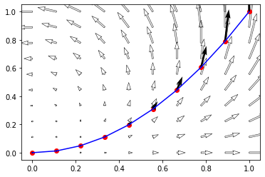
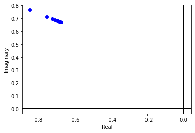

A contour is a finite collection of paths joined end to end. A path can be represented as a continuous function form an closed iterval to $\mathbb{C}$ as follows 
$$ \gamma: [a~ b]\subset \mathbb{R} \to \mathbb{C}; \quad \gamma = \gamma(t)$$ 
Then the integration of any complex function along this path is is given by 
$$\int_\gamma f(z)dz = \int_a^b f(t)~\gamma'(t)~dt = \sum_{i=1}^n f(t_i) \left[\gamma(t_i)-\gamma(t_{i-1})\right] $$

**Question:** Find the integration of $f(z)=z^2$ along the parabolic path from $0$ to $1$.

**Answer:** In order to find the integration we have to find to parametrize the curve as $\gamma(t)=t+t^2i$, $t\in [0,1]$.

    

    

## Numerical Computation

We can subdivide the curve into equal parts and then compute the sum as given in the definition. For 100 subdivisions we have the following result 

$\displaystyle -0.681868679980602 + 0.675438053988273 i$

We can improve the accuracy by increasing the number of subdivisions, For example the same integration for 1000 subdivisions will be

$\displaystyle -0.668168668668 + 0.66753436803537 i$

We can plot the result for a number of points to see the convergence in complex plane as follows

    

    

## Parametrization
Now we do the same computation using the parametrization of the curve, hence the value turns out to be exactly equalt to

$\displaystyle -0.666666666666667 + 0.666666666666667 i$

