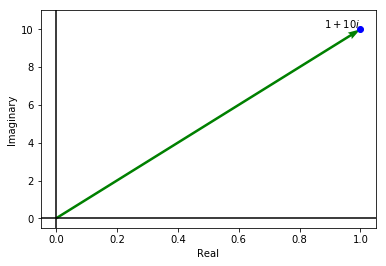
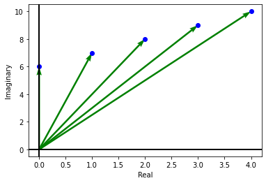
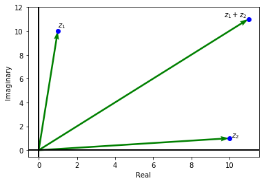

A complex numbers $x+iy$ can be plotted in cartesian coordinate as the point $(x,y)$. This plane is called Argand plane. 

    

    

    

    

### Addition and Substraction

Addition and substraction of complex numbers in Argand plane are similar to the vector addition and multiplication. 

    

    

## Multiplication in Complex Numbers

If we multiply two complex number $z_1=r_1e^{i\theta_1}$ and $z_2=r_2e^{i\theta_2}$, then we get 

$$z_1\cdot z_2 = r_1\cdot r_2 e^{i (\theta_1 + \theta_2)}$$

Hence in polar coordinate, the magnitude will get multiplies while angle will get added.

## Sequence and Series in Complex Numbers

Similar to real sequance, a complex sequence in simple a function $f: \mathbb{N} \to \mathbb{C}$.

Example of a diverging sequence.
