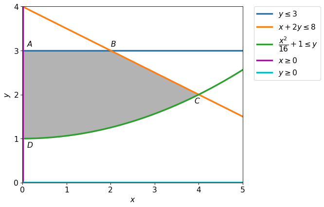

Solve the following optimization problem
$$
\begin{alignat*}{2}
    & \text{minimize: } && xy \\
    & \text{subject to: } && 
        \begin{aligned}[t]
            x+2y &\leq 8\\
            \dfrac{x^2}{16}+1 &\leq y \\
            x &\geq 0 \\
            0 \leq y &\leq 3
        \end{aligned}
\end{alignat*}
$$   

    

    

We can see that the constraint $y\geq 0$ is not active. So we don't have to include this constraint in our solution.

### Case I

First we search for critical points in the interior of the region.

$\displaystyle 
f = x y\\
g_1 = - y + 3\\
g_2 = - x - 2 y + 8\\
g_3 = - \frac{x^{2}}{16} + y - 1\\
g_4 = x
$

The lagrangian $L=\lambda_{1} \left(- y + 3\right) + \lambda_{2} \left(- x - 2 y + 8\right) + \lambda_{3} \left(- \frac{x^{2}}{16} + y - 1\right) + \lambda_{4} x + x y$

$\displaystyle - \lambda_{2} - \frac{\lambda_{3} x}{8} + \lambda_{4} + y= 0 \\- \lambda_{1} - 2 \lambda_{2} + \lambda_{3} + x= 0 \\\lambda_{1} \left(- y + 3\right)= 0 \\\lambda_{2} \left(- x - 2 y + 8\right)= 0 \\\lambda_{3} \left(- \frac{x^{2}}{16} + y - 1\right)= 0 \\\lambda_{4} x= 0 \\$

|$x$|$y$|$\lambda_{1}$|$\lambda_{2}$|$\lambda_{3}$|$\lambda_{4}$|Obj|
|---|---|---|---|---|---|---|
|$0$|$4$|$0$|$0$|$0$|$-4$|$0$|
|$0$|$3$|$0$|$0$|$0$|$-3$|$0$|
|$0$|$1$|$0$|$0$|$0$|$-1$|$0$|
|$0$|$0$|$0$|$0$|$0$|$0$|$0$|

