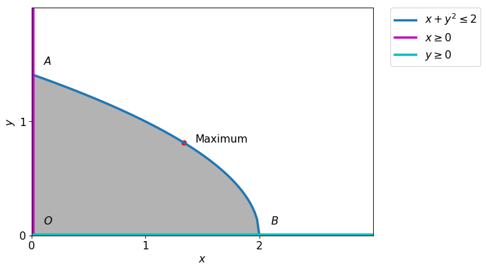

Solve the following optimization problem
$$
\begin{alignat*}{2}
    & \text{maximize: } && xy \\
    & \text{subject to: } && 
        \begin{aligned}[t]
             x+y^2 &\leq 2\\
            x,y &\geq 0 
        \end{aligned}
\end{alignat*}
$$   

### Step I

We try to draw the feasible region.

    

    

### Step II

Defining variable and functions.

$\displaystyle 
f = x y\\
g_1 = - x - y^{2} + 2\\
g_2 = y\\
g_3 = x
$

### Step III

Forming the Lagrangian.

The lagrangian $L=\lambda_{1} \left(- x - y^{2} + 2\right) + \lambda_{2} y + \lambda_{3} x + \lambda_{4} x + x y$

### Step IV

We will find the KKT equations, here we first solve only equalities. Later we use inequalities to remove extra points. 

$\displaystyle - \lambda_{1} + \lambda_{3} + y= 0 \\- 2 \lambda_{1} y + \lambda_{2} + x= 0 \\\lambda_{1} \left(- x - y^{2} + 2\right)= 0 \\\lambda_{2} y= 0 \\\lambda_{3} x= 0 \\$

|$x$|$y$|$\lambda_{1}$|$\lambda_{2}$|$\lambda_{3}$|Obj|
|---|---|---|---|---|------|
|$0$|$0$|$0$|$0$|$0$|$0$|
|$\frac{4}{3}$|$- \frac{\sqrt{6}}{3}$|$- \frac{\sqrt{6}}{3}$|$0$|$0$|$- \frac{4 \sqrt{6}}{9}$|
|$\frac{4}{3}$|$\frac{\sqrt{6}}{3}$|$\frac{\sqrt{6}}{3}$|$0$|$0$|$\frac{4 \sqrt{6}}{9}$|

**Conclusion:** Since $\lambda$'s must be nonnegative, hence we have to discard the second point. As both the point lies in the feasible region, they are local maxima, but the second point is global maxima.
